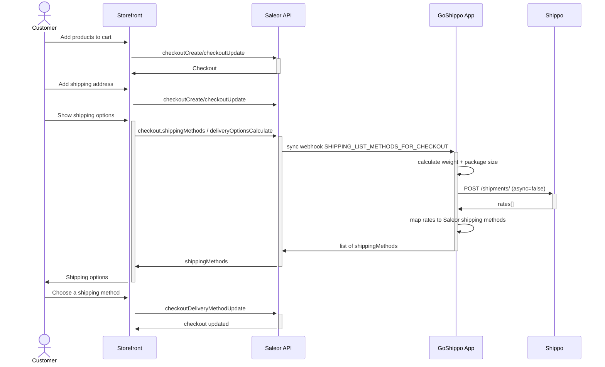

<div align="center">

</img>
</div>

<div align="center">
  <h1>GoShippo Saleor Shipping App</h1>
</div>

<div align="center">
  <p>Saleor app that connects to <a href="https://goshippo.com/">Shippo</a> for live checkout shipping rates.</p>
</div>

<div align="center">
  <a href="https://saleor.io/">Saleor</a>
  <span> | </span>
  <a href="https://docs.goshippo.com/">Shippo docs</a>
  <span> | </span>
  <a href="https://docs.goshippo.com/guides/client-libraries">Shippo SDKs</a>
</div>

## Introduction

This app integrates Saleor with [Shippo](https://goshippo.com/) using the sync webhook `SHIPPING_LIST_METHODS_FOR_CHECKOUT`. When the storefront asks Saleor for shipping methods, Saleor calls this app; the app creates a Shippo shipment (`async: false`) and returns rates as Saleor shipping methods.

Based on Saleor's [ShipStation example app](https://github.com/saleor/examples/tree/main/example-app-shipstation), adapted for Shippo.



## Shippo client

Uses the official Node SDK (`shippo` package) — see [Shippo client libraries](https://docs.goshippo.com/guides/client-libraries).
Rates are retrieved by creating a shipment with `async: false` ([rating guide](https://docs.goshippo.com/docs/stories/single_rating_guide/)).

### Package weight

Weight is the sum of all line item weights (`CheckoutLine.variant.weight`). Supported units: grams, ounces, pounds (kg is converted to grams).

### Package size

The app assumes three package types (see `src/modules/shippo/types.ts`):

- envelope
- smallBox
- largeBox

It reads the product attribute slug `package-size` and picks the smallest box that fits the cart (same heuristics as the original ShipStation example).

### Shippo rate request

Rates are fetched by creating a Shippo shipment with:

- `address_from` from env (`FROM_*`)
- `address_to` from the checkout shipping address
- one parcel (weight + dimensions)
- optional `carrier_accounts` from `CARRIER_ACCOUNT_IDS`

See [Get a shipping label / rates guide](https://docs.goshippo.com/docs/stories/single_rating_guide/).

### Subscriptions

#### ShippingListMethodsForCheckout

Returns live Shippo rates for the checkout. Requires a complete shipping address (street, city, postal code, country).

#### OrderCreated

Placeholder for purchasing a Shippo label after checkout. See comments in `src/pages/api/webhooks/order-created.ts`.

## Development

### Requirements

- [Node.js](https://nodejs.org/en/)
- [pnpm](https://pnpm.io/)
- A Shippo account + API token ([portal](https://portal.goshippo.com/))

```bash
cd apps/goshippo
pnpm install
cp .env.example .env
# fill SHIPPO_API_KEY and FROM_* address fields
pnpm dev
```

Expose the app with a tunnel (ngrok / localtunnel), then install in Saleor Dashboard:

```
[YOUR_SALEOR_DASHBOARD_URL]/apps/install?manifestUrl=[YOUR_APP_TUNNEL]/api/manifest
```

App id: `saleor.app.goshippo`

### Environment

| Variable              | Required | Description                                                      |
| --------------------- | -------- | ---------------------------------------------------------------- |
| `SHIPPO_API_KEY`      | yes      | Shippo API token (`shippo_test_…` for test mode)                 |
| `FROM_NAME`           | yes      | Origin contact name                                              |
| `FROM_STREET1`        | yes      | Origin street                                                    |
| `FROM_CITY`           | yes      | Origin city                                                      |
| `FROM_ZIP`            | yes      | Origin postal code                                               |
| `FROM_COUNTRY`        | yes      | Origin ISO country (e.g. `US`)                                   |
| `FROM_STATE`          | no       | Origin state/province                                            |
| `CARRIER_ACCOUNT_IDS` | no       | Comma-separated Shippo carrier account IDs; empty = all carriers |

### APL

- `file` (default) — local only
- `upstash` — set `APL=upstash` plus `UPSTASH_URL` / `UPSTASH_TOKEN` for production

### Limitations

- `ORDER_CREATED` does not purchase labels yet (stub)
- All Saleor variants in a checkout should use the same weight unit family
- Sync webhooks must respond quickly; consider caching rates by destination + weight for high traffic
- Product attribute `package-size` should use slugs `envelope`, `smallBox`, or `largeBox`
